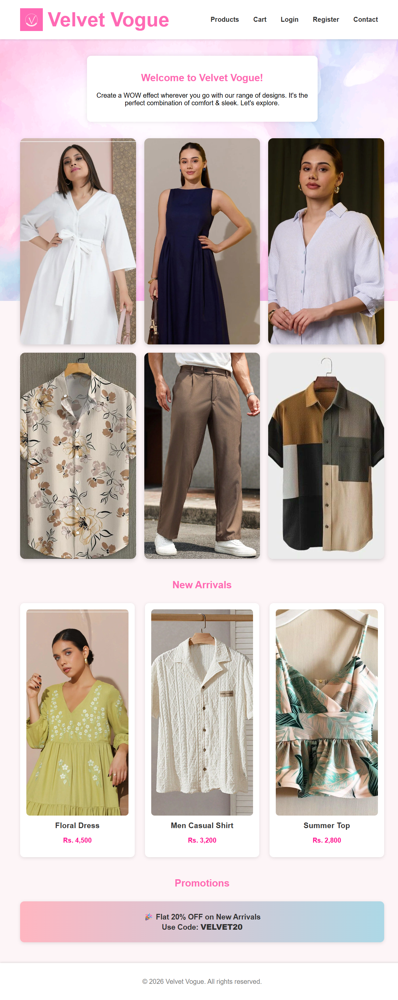
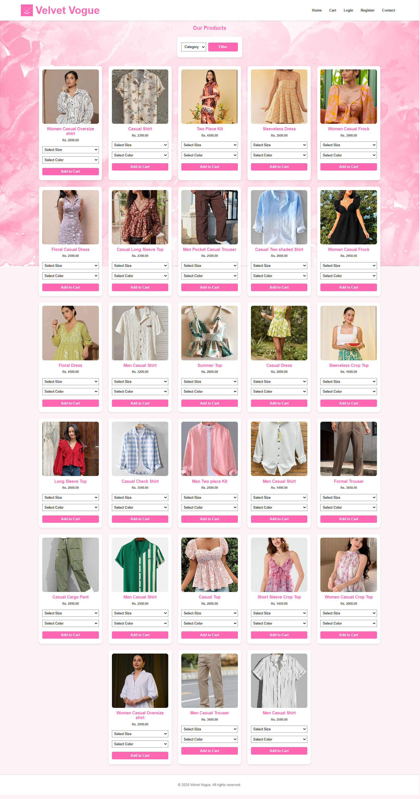
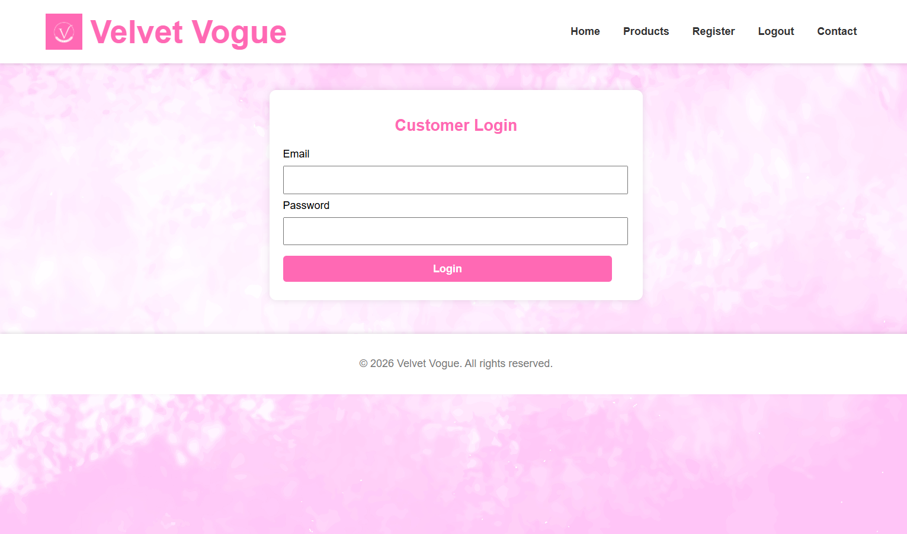
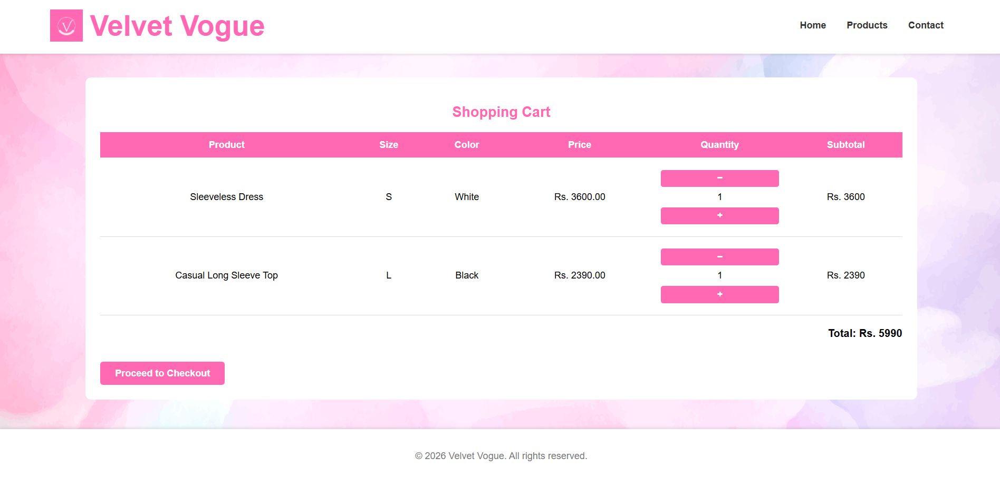

# Velvet Vogue – E-commerce Website

Velvet Vogue is a PHP and MySQL-based e-commerce website developed as a web development project. The system provides a simple online shopping experience with features such as user registration, login, product browsing and shopping cart management.

## Features

* User Registration
* User Login
* Product Browsing
* Product Categories
* Shopping Cart
* Product Images
* Customer Support Page
* MySQL Database Integration
* Responsive Web Interface

## Technologies Used

* PHP
* MySQL
* HTML
* CSS
* JavaScript
* WAMP Server
* Visual Studio Code

## Development Environment

The website was developed and tested locally using WAMP Server.

### Local Setup

1. Install WAMP Server.
2. Copy the project folder into:

```text
C:\wamp64\www\
```

3. Start Apache and MySQL from WAMP.
4. Create a MySQL database named:

```text
velvet_vogue
```

5. Import the project's database SQL file into phpMyAdmin.
6. Create the local database configuration file:

```text
config/db.php
```

7. Add the local database connection details to `config/db.php`.
8. Open the website in a browser:

```text
http://localhost/velvet_vogue/
```

## Database Configuration

The database configuration file is intentionally excluded from this repository because it contains local database credentials.

Create `config/db.php` locally and add the required MySQL connection details.

## Project Purpose

This project was developed to practice PHP web development, MySQL database integration, user authentication, e-commerce functionality and frontend web development.

## Author

**Nethma Sathsini**

GitHub: [NethmaSathsini](https://github.com/NethmaSathsini)

## Screenshots

### Homepage



### Products



### Login



### Shopping Cart

